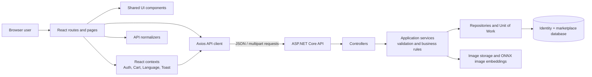
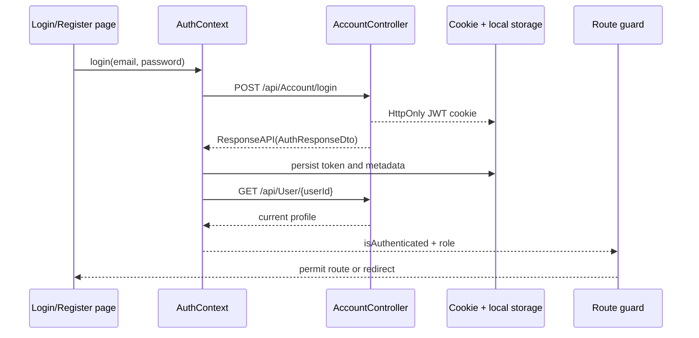

# ElAtaba Frontend Architecture and API Integration

This document describes the current React frontend in `frontend/`, its state and routing model, and how its main features communicate with the ASP.NET Core API in `Elattaba.API/`.

> Scope: this is a description of the code as it exists today. The API is the final authority for identity, permissions, prices, stock, and order creation.

## 1. Technology and entry points

| Area | Implementation |
| --- | --- |
| UI framework | React 19 + TypeScript |
| Build and local development | Vite |
| Routing | React Router (`BrowserRouter`) |
| HTTP | Axios, through one shared client |
| Icons | Lucide React |
| Backend | ASP.NET Core API, EF Core, SQL Server/Identity |

The browser begins at `frontend/src/main.tsx`, renders `App.tsx`, and is wrapped by providers in the following order:

```text
BrowserRouter
  LanguageProvider
    AuthProvider
      ToastProvider
        CartProvider
          AppContent (Navbar + route + Footer)
```

This order is intentional: the cart needs the current authenticated user to select its storage key, and screens can use authentication, language, cart, and toast hooks below the providers.

## 2. High-level architecture



The frontend is a client-rendered single-page application. It owns presentation state and local cart persistence; it does **not** own trusted marketplace state. The backend recalculates protected values and applies authorization before persisting anything.

### Frontend folders

| Path | Responsibility |
| --- | --- |
| `src/api/client.ts` | Axios base URL, credential/token handling, global HTTP error behavior |
| `src/api/normalizers.ts` | Converts entity-specific API IDs (`productId`) to the UI's `id` convention |
| `src/context/` | Application-wide auth, cart, language, and toast state |
| `src/components/` | Reusable shell and feature components (navbar, product cards, cropper, etc.) |
| `src/pages/` | Buyer/public pages and shared user pages |
| `src/pages/seller/` | Seller store setup, dashboard, inventory, offers, orders, settings |
| `src/pages/admin/` | Administration dashboard and reference-data management |
| `src/types/index.ts` | Frontend domain types and enum values aligned to the API |

## 3. Routing and authorization

`src/App.tsx` lazy-loads every page with `React.lazy`, so page code is loaded only when a route is visited. It also includes three route guards.

| Guard | Required role | Protected use |
| --- | --- | --- |
| `BuyerRoute` | `Buyer` | Checkout, order list, order detail |
| `SellerRoute` | `Seller` or `StoreManager` | Store creation and seller dashboard tabs |
| `AdminRoute` | `Admin` | Admin dashboard tabs |

Public routes include catalog home, product browsing/detail, image search, login, and registration. `/cart` is currently reachable without the buyer route so a guest can keep a local cart; `/checkout` then requires a buyer login.

The guards improve navigation and user experience, but they are not a security boundary. Backend controller policies (`BuyerOnlyPolicy`, `SellerOnlyPolicy`, and `AdminOnlyPolicy`) make the final authorization decision.

## 4. Cross-cutting frontend logic

### 4.1 API client and response handling

`src/api/client.ts` creates a single Axios client with:

- Base URL: `http://localhost:5191`.
- `withCredentials: true`, allowing the browser to send the API's HttpOnly JWT cookie.
- A request interceptor that also sends `Authorization: Bearer <token>` from `localStorage` as a fallback.
- A response interceptor that classifies failures: validation/business errors (400), expired/invalid session (401), permission failure (403), server failures (500), and network failures.

API responses normally use this envelope:

```json
{
  "statusCode": 200,
  "message": "Success",
  "data": {}
}
```

Pages therefore read their payload from `response.data.data`.

### 4.2 API normalizers

The API uses entity-specific ID names such as `productId`, `categoryId`, `orderId`, and `offerId`. Existing components expect a generic `id`. `src/api/normalizers.ts` centralizes this translation.

For example, `toProduct` maps `productId` to `id`, maps image and tier identifiers, and exposes `hasActiveOffer` under `hasOffer`. New screens should use these normalizers instead of duplicating mapping logic or assuming API DTO property names.

### 4.3 Authentication state

`AuthContext` is the source of truth for the current browser session:

1. On startup it reads persisted session metadata from `localStorage`.
2. If a token exists, it calls `GET /api/User/{userId}` to validate and refresh the local profile.
3. Login and registration call the account endpoints, retain the returned access token and identity metadata, then trigger profile loading.
4. Logout calls the backend to remove the cookie, then always clears frontend state and local storage.
5. Any API 401 invokes the registered unauthorized callback, which performs the same local cleanup.

Stored keys are `elAtaba_token`, `elAtaba_userId`, `elAtaba_email`, `elAtaba_role`, and optionally `elAtaba_storeId`. The API also writes an HttpOnly JWT cookie. This is a transitional hybrid approach: it is convenient for the current client, but storing a bearer token in `localStorage` increases XSS exposure compared with relying only on an HttpOnly cookie.

Role values are numeric in frontend types:

```text
Buyer = 0, Seller = 1, Admin = 2, StoreManager = 3
```

### 4.4 Cart state and price display

`CartContext` maintains a local cart, keyed per authenticated user:

```text
guest                 -> elAtaba_cart_guest
signed-in user 123    -> elAtaba_cart_123
```

It reloads the appropriate cart when `userId` changes and persists each subsequent change. The UI groups items by `storeName` to explain that mixed-store carts become separate orders.

For display, `getItemPrice` selects the highest matching quantity tier, otherwise it uses the product DTO's `currentPrice`, which is the API-calculated active-offer price. This is a convenience calculation only. Checkout intentionally sends only product IDs and quantities, and the backend recalculates the charged price.

### 4.5 Language and notifications

`LanguageContext` controls the current English/Arabic UI selection, including RTL/LTR presentation decisions made by pages. `ToastContext` exposes `showToast(message, type)` for user feedback. Page-level validation uses toasts before a request; server-side errors are also surfaced by the shared API client's callbacks.

## 5. API integration reference

All paths below are relative to `http://localhost:5191`. Read endpoints may be public unless their controller has `[Authorize]`; the role shown is enforced by the backend.

| Frontend capability | Endpoint(s) used | Notes |
| --- | --- | --- |
| Session | `POST /api/Account/register`, `POST /api/Account/login`, `POST /api/Account/logout`, `GET /api/User/{id}` | Login/register return token, user, role, and store information. |
| Catalog | `GET /api/Product`, `GET /api/Product/{id}`, `GET /api/Product/best-deals` | Product list supports query filters such as store/category/search/paging used by catalog pages. |
| Reference data | `GET /api/Category/GetAll`, `GET /api/Governorate`, `GET /api/Carrier`, `GET /api/ShippingRate` | Used by catalog filters, registration/profile, checkout display, and admin screens. |
| Checkout/orders | `POST /api/Checkout`, `GET /api/Order`, `GET /api/Order/{id}`, `PUT /api/Order/{id}/status` | Checkout is buyer-only; status updates are seller-only. |
| Reviews/messages | `GET /api/Review/product/{id}`, `POST /api/Review`, `POST /api/Message` | The backend verifies review/order ownership. |
| Seller store | `POST /api/Store`, `GET/PUT /api/Store/{id}`, `PUT /api/Store/{id}/logo` | Seller/store-manager authorization and store ownership are checked server-side. |
| Seller products | `POST /api/Product`, `POST /api/Product/create-with-offer`, `PUT/DELETE /api/Product/{id}` | Product creation/update requests are multipart forms because images are uploaded. |
| Seller offers | `GET /api/Offer`, `POST /api/Offer`, `DELETE /api/Offer/{id}` | Backend validates store ownership and offer overlap rules. |
| Image search | `POST /api/Product/search-by-image` | Multipart request; it is public. |
| Admin | `POST/DELETE /api/Category`, `POST /api/Governorate`, `POST /api/Carrier`, `POST /api/ShippingRate`, `POST /api/ProductImage/rebuild-embeddings` | Administrative controller policies enforce access. |

For `FormData` requests, the page explicitly passes `Content-Type: undefined`. This lets Axios/the browser add the required multipart boundary; do not manually set `multipart/form-data` with no boundary.

## 6. Key end-to-end feature flows

### 6.1 Authentication and protected navigation



The server authenticates JWTs from either the Bearer header or its cookie. On each privileged API call the backend uses role policies and the current-user service; a client-side role switch or modified browser storage cannot grant API permissions.

### 6.2 Catalog, cart, offers, and checkout

```mermaid
sequenceDiagram
  participant Catalog as Catalog/product page
  participant Cart as CartContext
  participant Checkout as Checkout page
  participant API as CheckoutService
  participant DB as Database

  Catalog->>API: GET /api/Product
  API-->>Catalog: product DTOs with currentPrice and pricing tiers
  Catalog->>Cart: add product and quantity
  Cart->>Cart: select display tier/current price; persist locally
  Checkout->>Cart: read product IDs and quantities
  Checkout->>API: POST /api/Checkout
  API->>DB: validate buyer, products, stock, and active offers
  API->>DB: group items by store; create one order per store
  API->>DB: decrement stock and save transaction
  API-->>Checkout: checkout reference + created orders
  Checkout->>Cart: clear cart only after successful response
```

The checkout request shape is:

```json
{
  "buyerId": 42,
  "carrierId": null,
  "shippingAddressSnapshot": "Full delivery address",
  "paymentMethod": 0,
  "items": [
    { "productId": 10, "quantity": 3 },
    { "productId": 18, "quantity": 1 }
  ]
}
```

The backend aggregates duplicate product IDs, checks stock, fetches active offers for each store, groups items by `storeId`, and creates one `Order` per store. It uses the backend `OfferPricingCalculator` to choose the best active applicable offer (highest percentage, then newest) and takes the final unit price and stock reduction from the database transaction.

Important consequence: cart `selectedPrice`, the displayed shipping estimate, and any altered browser request body are not trusted by the server. The frontend must treat the returned checkout result/order details as authoritative.

### 6.3 Seller product creation and immediate offer

1. `SellerDashboard` loads the seller's products, orders, offers, and categories using its `storeId`.
2. `ProductInventory` gathers product fields and selected image files into `FormData`.
3. A normal create posts to `POST /api/Product`; an "launch with offer" submission posts to `POST /api/Product/create-with-offer` and adds the discount and a one-week date window.
4. `ProductController` validates the multipart model, then calls `ProductService`.
5. The service checks that the logged-in seller may manage the supplied store, validates data and images, writes the image files, saves the product/offer, and returns a normalized product DTO source.
6. The dashboard refreshes its server data after a successful mutation.

The server, not the client, validates seller store ownership, required images, offer dates, and overlapping offer rules.

### 6.4 Seller offers and catalog pricing

The seller offer form sends:

```json
{
  "storeId": 7,
  "discountPercentage": 15,
  "startDate": "2026-07-18T00:00:00.000Z",
  "endDate": "2026-07-25T00:00:00.000Z",
  "appliesToAllProducts": false,
  "productIds": [10, 11]
}
```

An offer can apply to every product in a store or to an explicit list. When products are fetched, the backend determines active offers using UTC time and returns `currentPrice`. Cart display uses that price unless a qualifying quantity tier is selected. During checkout, the backend repeats offer selection and persists the price in the order item, so later offer edits do not rewrite historical order prices.

### 6.5 Image search

`ImageSearchCropper` gives `ImageSearch` a selected/cropped browser `File`. The page sends that file as multipart field `image` to `POST /api/Product/search-by-image`; no manual content type is supplied.

On the backend, `ProductService` creates an ONNX image embedding for the submitted image, compares it with stored product-image embeddings by cosine similarity, and returns the highest-scoring matches. Product-image embedding generation is handled in the background when images are managed; an admin can request a rebuild through `POST /api/ProductImage/rebuild-embeddings`.

The page currently contains development mock results when the request fails. That is useful for demonstration, but it can make a production failure look like a real search result. Remove or gate this fallback before production release.

## 7. Backend responsibilities relevant to frontend work

The backend uses a layered flow:

```text
HTTP controller
  -> application service (rules, authorization ownership checks, mapping)
  -> Unit of Work / repositories
  -> EF Core persistence
```

Controllers wrap normal outcomes in `ResponseAPI`. Application services return a `ServiceResult`, which preserves a success flag, HTTP status, message, and optional data. Global exception handlers cover unexpected, database, and concurrency failures. Product and checkout stock updates use EF Core concurrency behavior; callers should display the returned error and refresh affected product data after a conflict.

The API allows credentialed browser requests only from configured CORS origins. The development defaults include `http://localhost:5173`, matching Vite's usual local port. If the frontend URL or API port changes, update `frontend/src/api/client.ts` and the backend CORS/app settings together.

## 8. Current integration notes and follow-up items

These are observations from the existing code, not proposed behavior.

1. **Shipping total differs between UI and checkout payload.** The checkout page displays `unique store count × shippingRate` (with a fallback of 15), but sends no shipping rate/cost to `POST /api/Checkout`; the current checkout service totals item subtotals only. Decide whether shipping belongs in backend calculation and return it in `CheckoutResultDto`, or label the current UI amount as an estimate.
2. **Quantity tier write support needs confirmation.** `ProductInventory` appends `pricingTiersJson` to its multipart form, while the current `ProductController` form DTOs expose no matching field and its create/update commands do not accept tiers. That field is not persisted by the shown product endpoints. Add a supported API contract/service path before presenting tier edits as saved.
3. **Profile and messages are not wrapped in a route guard.** Their pages may depend on API authorization, but `App.tsx` does not require `isAuthenticated` before rendering them. Add a shared authenticated route guard if anonymous navigation should be prevented cleanly.
4. **Global toast callback is not wired by `ToastContext`.** `AuthContext` registers a global error callback that currently logs to the console. Page-local failures are handled inconsistently. Consider registering the toast dispatcher once so unhandled API failures produce a visible message.
5. **Hybrid token storage is a security trade-off.** The API supports secure HttpOnly cookies, but the frontend also keeps the token in `localStorage` and sends it as a Bearer token. Prefer a cookie-only session design with CSRF protections if the frontend and API remain same-site/cross-origin credentialed.
6. **Image-search mock results should be development-only.** Failed live search requests currently return fabricated items to the UI.

## 9. Safe extension patterns

When adding a frontend feature:

1. Define or update the API DTO and application-service contract first when it changes trusted state.
2. Add the endpoint call through `apiClient`; use `FormData` only for binary uploads.
3. Add a normalizer if the API's DTO shape differs from the shared UI type.
4. Keep transient form state inside the page/component; use context only for true cross-screen state.
5. Add a route guard for UX, then enforce the same ownership/role rule in the API.
6. Reload/refetch server-owned data after a mutation instead of assuming local optimistic values are final.
7. Test success, validation failure (400), unauthenticated (401), forbidden (403), missing resource (404), and network failure paths.

## 10. Local development checklist

1. Start the API at the configured `http://localhost:5191` URL.
2. Start Vite from `frontend/` (normally `npm run dev`, which serves on port 5173).
3. Confirm the API CORS allowed origins includes the Vite URL and allows credentials.
4. Use the API Swagger endpoint in development to inspect the live contract when changing DTOs.
5. Run `npm run build` in `frontend/` before handing off UI changes.

## 11. Key source files

| Concern | Files |
| --- | --- |
| App shell, lazy routes, route guards | `frontend/src/App.tsx` |
| HTTP client and status handling | `frontend/src/api/client.ts` |
| API-to-UI mapping | `frontend/src/api/normalizers.ts` |
| Auth/local session | `frontend/src/context/AuthContext.tsx` |
| Local cart and display price selection | `frontend/src/context/CartContext.tsx` |
| Checkout request flow | `frontend/src/pages/Checkout.tsx` |
| Product image search | `frontend/src/pages/ImageSearch.tsx`, `frontend/src/components/ImageSearchCropper.tsx` |
| Seller inventory and multipart requests | `frontend/src/pages/seller/components/ProductInventory.tsx` |
| Offer management | `frontend/src/pages/seller/components/OfferManagement.tsx` |
| API startup/middleware | `Elattaba.API/Program.cs`, `Elattaba.API/Extensions/ApiApplicationExtensions.cs` |
| Auth policies/JWT | `Elattaba.API/Extensions/AuthServiceExtensions.cs`, `Elattaba.API/Controllers/AccountController.cs` |
| Checkout business rules | `Elattba.Application/Checkouts/CheckoutService.cs` |
| Offer price selection | `Elattba.Application/Offers/OfferPricingCalculator.cs` |
| Product API/upload contract | `Elattaba.API/Controllers/ProductController.cs` |
